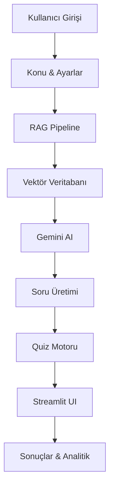

# 🎯 YDS/YÖKDİL RAG Quiz Generator

<div align="center">


**Akbank GenAI Bootcamp Projesi - Context-Aware English Exam Generator**

[🚀 Live Demo](#) • [📚 Documentation](#) • [💡 Features](#features)

</div>

## 📖 Overview

YDS/YÖKDİL RAG Quiz Generator, Retrieval Augmented Generation (RAG) teknolojisi kullanarak konuya özel İngilizce sınav soruları üreten akıllı bir uygulamadır. Geleneksel sabit soru bankaları yerine, kullanıcının belirlediği herhangi bir konuda anlamlı ve bağlamsal sorular oluşturur.

## 🛠️ Teknolojik Yapı
- **Frontend**:	Streamlit
- **AI Model**: Google Gemini 2.5 Flash
- **RAG Framework**: Özel Pipeline
- **Vektör Veritabanı**: Chroma DB
- **Veri İşleme**: PDFplumber, LangChain


## 🎯 Features

### 🤖 Smart Question Generation
- **Context-Aware**: RAG mimarisi ile konuya özgü sorular
- **Multiple Question Types**: Cloze tests, reading comprehension, vocabulary, grammar
- **Adaptive Difficulty**: YDS/YÖKDİL seviyesine uygun akademik İngilizce
- **Mixed Mode**: Akıllı karışık soru dağılımı

### ⚡ Real-time Experience
- **Live Timer**: Gerçek zamanlı sınav deneyimi
- **Instant Feedback**: Anlık sonuç ve detaylı analiz
- **Progress Tracking**: Soru tipi bazında performans takibi

### 🎨 User-Friendly Interface
- **Streamlit UI**: Modern ve responsive arayüz
- **Topic Customization**: Her konuda sınav oluşturma
- **Flexible Settings**: Soru sayısı ve tipi özelleştirme

## 🏗️ Architecture


## 📊 Veri Seti Bilgileri

### 🎯 Örnek Veri Seti
**Veri seti şunları içerir**:

- **Akademik kelime bilgisi** ve karmaşık cümle yapıları
- **Çeşitli konular**: teknoloji, çevre, eğitim, sağlık, ekonomi
- **YDS/YÖKDİL seviyesine** uygun içerik
- **Temiz, işlenmiş metin** - RAG pipeline'ı için hazır

### **Projenini temelinde yapılan çalışmada ÖSYM ait sorular üstünde çalışılmış olup telif hakları sebebiyle kaldırılmıştır**.Sorular ÖSYM'nin kendi sitesinden alınıp filigran kaldırma işlemi uygulanınıp pdfplumber ile işlenerek RAG için uygun hale getirilmiştir.**Bu proje, YDS/YÖKDİL sınav hazırlığı için özel olarak hazırlanmış **örnek akademik İngilizce veri seti** içermektedir.**

1. **Depoyu Klonlayın**
```bash
git clone https://github.com/DoubleHift/AKBANK_AI_Bootcamp
cd yds-rag-quiz-generator
```
2. **Sanal Ortam Oluşturun ve Aktif Edin**
```bash
# Sanal ortam oluşturma
python -m venv venv

# Sanal ortamı aktif etme
# Windows:
venv\Scripts\activate
# macOS/Linux:
source venv/bin/activate
```
3. **Gereksinimleri Yükleyin**
```bash
pip install -r requirements.txt
```
4. **Çevre Değişkenlerini Ayarlayın**
```bash
# Örnek environment dosyasını kopyalayın
cp .env.example .env

# .env dosyasını düzenleyin ve Gemini API anahtarınızı ekleyin
# GEMINI_API_KEY=your_actual_gemini_api_key_here
```
5. **Uygulamayı Çalıştırın**
```bash
streamlit run app.py
```
6. **Tarayıcıda Açın**
- http://localhost:8501 adresine gidin
- Uygulama otomatik olarak açılacaktır

### 🔧 Kendi Veri Setinizi Kullanma
Kendi materyallerinizi kullanmak için:

1. **Metin kaynaklarınızı hazırlayın** (PDF, DOC, TXT dosyaları)
2. **Veri hazırlama script'ini çalıştırın**:
```bash
python data_prep.py
```

### 🔑 Gemini API Anahtarı Alma
- Google AI Studio'yu ziyaret edin
- Google hesabınızla giriş yapın
- Sağ üst köşedeki "Get API key" butonuna tıklayın
- "Create API key" butonuna tıklayın
- Anahtarı kopyalayıp .env dosyanıza ekleyin

# 💡 Kullanım
 ## 🚩Konu: Herhangi bir konu girin:
 - örnek: Yapay zeka, İklim değişikliği
 ## ⁉ Soru Tipi:
- Karışık - Tüm soru tiplerinden dengeli dağılım

- Boşluk Doldurma - Klasik YDS boşluk doldurma

- Paragraf Sorusu - Okuma-anlama soruları

- Kelime Anlamı - Eş anlamlı kelimeler

- Dil Bilgisi - Gramer ve yapı soruları

## 🔢Soru Sayısı: 
- 1-80 arası soru

## 💪Sınav Deneyimi
- Zaman Yönetimi: Soru tipine göre otomatik süre hesaplama

- Navigasyon: Sorular arasında gezinme

- İlerleme Takibi: Görsel ilerleme göstergesi

- Gerçek Zamanlı Geri Bildirim: Anlık doğru/yanlış kontrolü

## 🔎Sonuç Analizi
- Detaylı Skorlama: Genel ve kategori bazlı performans

- Zaman Analizi: Tamamlama süresi takibi

- Soru İnceleme: Her soru için detaylı açıklamalar

- Performans İstatistikleri: Güçlü ve zayıf yönlerin tespiti

```bash
AKBANK_AI_Bootcamp/
├── app.py                 # Ana Streamlit uygulaması
├── rag_pipeline.py        # RAG soru üretim motoru
├── data_prep.py           # Veri hazırlama
├── requirements.txt       # Python bağımlılıkları
├── .env.example           # Çevre değişkenleri şablonu
├── README.md              # Proje dokümantasyonu
├── data/                  # İşlenmiş veriler
│   └── cleaned_corpus.txt
└── examples/              # Örnek sorular
    └── sample_questions.json
```
